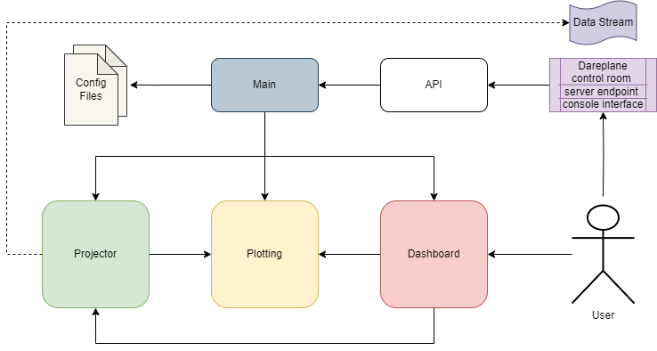
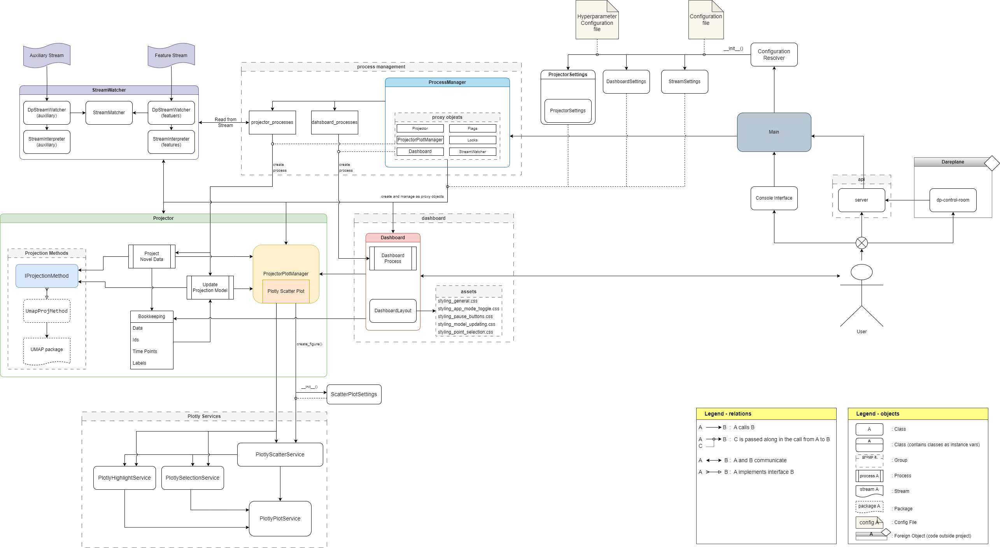

This document provides an overview and explanation of the Online Neurodata and Embedding Projector (ONEP) from a development perspective. The following content focuses on the general structure of the project as well as the implementation details of core features/classes. It is recommended to have read the user guide, particularly the terminology and launch steps sections.

## Running Without the Server

It is possible to run the application without using the Dareplane Control Room or otherwise making calls to the API. To do so, simply run the `main.py` file using a valid interpreter. Note that running the program like this allows for the projector to be run in continuous and sequential modes. Continuous mode means that a thread will be made for projecting and updating the model, which will run these processes continuously in a loop. Sequential mode requires a direct call to be made to the projector for data to be projected or a model update to be triggered. When using sequential mode, the dashboard is not passed a `ProjectorContinuesShell` object, but a `Projector` object directly. This results in the pausing of the projector processes to have no effect, meaning the buttons for this on the dashboard do nothing in this mode. To halt the refreshing of the dashboard plot, the application should still be switched to interactive mode.

Additionally, when wanting to avoid using the data stream, it is possible to obtain mocked data from the `DataMocker` utility class. To use this class, change are references to the `StreamWatcher` utility class to make use of the data mocker.

## General Structure

The application is split up into three major parts; the projector, plotting, and the dashboard. Some additional code segments are separate from these three parts, such as the API, main class, and some utility functions. The flow chart below shows how the sections of the code interact. The sections shown here will occasionally be referred to as subprocesses in this document.

<picture>
    <source srcset="./assets/flowchart.png"  media="(prefers-color-scheme: dark)">
    
</picture>

## User Interface

**Projector** 
The projector subprocess is mainly executed by the `Projector` class, with some additional functionality derived from its wrapper class `ProjectorContinuesShell`, which implements the threading, and from the projection method-specific wrapper classes.

**Plotting** 
Plotting is performed by the `ProjectorPlotManager` class and a handful of custom Plotly services under the `./plotly_serivces` folder. These Plotly services are designed to be general-purpose services that depend on the Plotly framework to support dynamic and continuous plotting functionalities.

**Dashboard** 
The dashboard flow is managed by the `Dashboard` and `DashboardLayout` classes. Where the `Dashboard` class implements the callback logic and the `DashboardLayout` class implements the page layout and elements. It utilizes a number of style sheets for this purpose.

**Class Structure** 
The flow of the application is, for the most part, reflected in its class structure. The only notable difference is that the `ProjectorPlotManager` class is located in the `Projector` subfolder because the `Projector` class maintains an instance of `ProjectorPlotManager`. The following diagram shows the class structure.

## User Interface
<picture>
    <source srcset="./assets/class-diagram.png"  media="(prefers-color-scheme: dark)">
    
</picture>

## Configuration

A number of settings classes are used at various points of the application’s lifetime. These setting classes contain multiple configurable settings that may be needed to create an instance of a class or object. The following settings classes are used:

- `ProjectorSettings`
- `PlotSettings`
- `DashboardSettings`
- `ScatterPlotSettings`

**Configuration files** 
Most of the settings in these classes are derived from the configuration toml file in the `./configs` folder. Additionally, the property hyperparameters in `ProjectorSettings` is filled using the projection-method-specific values stored in the relevant hyperparameter config file found in the `./config/hyperparameter` folder. For an overview and explanation of the configuration values see the “Configuration File” section of the user guide.

**Resolving configuration** 
When launching the application, an instance of each settings class, excluding `ScatterPlotSettings`, is created by the `ConfigurationResolver`. This class reads the content of the config and hyperparameter config files and uses it to build the settings classes instances. Note that during this process, an instance of `PlotSettings` is embedded into the instance of `ProjectorSettings` instead of being returned separately. 

**ScatterPlotSettings** 
The `ScatterPlotSettings` class is initiated and used in a different manner than the other settings classes. Due to the plotly services being static and not retaining an instance of a figure, when creating a new scatter plot an instance of `ScatterPlotSettings` must always be passed to the create function. Additionally, some of the properties of a plot may require to differ from that of the previous figure, resulting in the scatter plot settings changing throughout the application’s lifecycle. To handle this, a new instance of `ScatterPlotSettings` is created each time the `ProjectorPlotManager` needs to create a new scatter plot. To create this instance, the values contained in `PlotSettings` are used by the `ProjectorPlotManager`. This is resolved in the `_resolve_scatter_plot_settings()` function, which returns a new instance of `ScatterPlotSettings`. At the moment, only the x-axis range may change over time. Despite only a single property differing between instances of `ScatterPlotSettings`, the current implementation recreates these settings regularly. This implementation was chosen because settings classes are supposed to be static, therefore, utilizing only a single instance of `ScatterPlotSettings` and changing it over time would not comply with this convention.

## Projector

The projector subprocess depends on three classes in addition to some utility classes. These classes are the `ProjectorContinuesShell`, `Projector`, and a projection method wrapper class that implements the `IProjectionMethod`. The `Main` class initiates an instance of `ProjectorContinuesShell` which in turn creates an instance of `Projector`. The `Projector` class itself creates an object of the projection method wrapper class and of `ProjectorPlotManager`. The latter is used for the plotting subprocess. For this chain of instance initiations PlotSettings is passed by `Main` with the first init call.  The exact projector method wrapper class that will be used is determined by the `ProjectionMethodEnum` value contained in `ProjectorSettings`.

### Projector

The `Projector` is the core of the projector subprocess. It makes calls to the plotting subprocess, reads data from the data stream, keeps track of said data, and directs the projection method wrapper instance to create new projections or train a new instance of the projection model. 

To keep track of the provided data, the `Projector` stores three lists and a data frame. The data frame `_historic_df` contains the data from the data stream, labels, and time points of all data entries that have been used to train the latest projection model iteration. Additionally, `_recent_data`, `_recent_labels`, and `_recent_timepoints` contain similar information, however, this is only for the data entries that have been read from the data stream but have not been used yet for training a projection model. The historic data frame and recent data lists are kept separate due to the `_recent_data` list being a list of data frames. With the `_recent_data` being updated each time a data entry gets projected, which should be at a rate of a few milliseconds ideally, it would be too slow to instead express the list as a singular data frame that constantly gets appended or merged with a new data frame. Instead, the recent data lists are only added to the historic data frame each time a new projection model iteration is trained.

There are three main functions that are implemented by the `Projector`: `project_new_data()`, `update_projector()`, and `activate_latest_projector()`. 

- **project_new_data():**  
This method may be called by `ProjectorContinuesShell` or `Main`.
It starts by reading new data, time points, and labels from the data stream. These variables are then passed to the `project_data()` function which simply calls the projection method wrapper class to use the data to create new projections. The labels and time points are not used for this. The returned projections are then passed to `ProjectionPlotManager` to be plotted as a 2D point in the figure. Finally, the input data, labels, and time points are added to the recent data and the projections count is increased by the number of produced projections.
Before calling the projection method wrapper class, the method first checks if there is an active projection model. If there isn’t, the creation of the projections, plotting of the projections, and increasing the projection counter will be skipped.

- **update_projector():** 
This method may be called by `ProjectorContinuesShell` or `Main`.  
Firstly, the historic data frame will be updated using the content of the recent data lists. Afterward, the method determines if the updated historic data frame contains labeled, unlabeled, or hybrid data*. Depending on this, the method trains a new iteration of the projection model. This step takes by far the longest of all operations in the projector subprocess and will dominate its time complexity. When the new iteration has finished training, it is assigned to the  `_projection_model_latest` variable of the `Projector` and the update counter is increased by 1. 
If there is no active projection model set, the new model iteration is automatically assigned to be active.

> **Note.** the currently implemented projection methods, UMAP and CEBRA, do not support hybrid model training. As a result, a constant boolean has been declared in `Projector`, `SUPPORTS_HYBRID_MODEL`, that suppresses hybrid training as long as it is set to false. If the labeling of the data frame is hybrid, the data is treated as unlabeled. At the moment it is not possible to configure this boolean per projection method.

- **activate_latest_projector():** 
This method is called by `Dashboard` following an action taken by the user.
The method assigns the latest projection model to the active projection model. Then, using this model iteration, the entire content of the historical data frame is passed to the projection method wrapper class to create new projections. This functionally reprojects all data points using an updated projection model. Once these new projections are obtained, they, along with the labels and time points, are passed to the `ProjectorPlotManager` to create a new scatter plot figure with the new projections.

As mentioned in the above method descriptions, the `Projector` contains two projection model iterations, an active iteration and a latest iteration. These model iterations are stored in the private variables `_projection_model_curr` and `_projection_model_latest`. This split is made due to it being desirable that the updating of the in-use projection model is triggered manually by the user. Whenever this happens, the `activate_latest_projector()` method is called, setting the active projector equal to the latest projector. Additionally, whenever the first data is read from the data stream and no projection model has been trained yet, the active projection model will automatically be assigned whenever the first model iteration is done training, rather than this benign triggered by the user. Note that the training of the first projection model iteration is postponed until there is a user-defined number of data entries available to train on. This logic is contained in the `update_projector()` method.

Lastly, the `Projector` makes use of the pause flags provided by the `ProjectorContinuesShell` to avoid overlapping a projection operation with certain steps of model update operations. Whenever `project_new_data()` is called, an internal boolean called `_projecting_data` is set to true. This boolean is set to false just before the method returns. This boolean is used as a flag for the `update_projector()` and `activate_latest_projector()` methods to await the projecting of a new data point to be finished. Both methods do so whenever updating the historic data frame. Additionally, this is done in `activate_latest_projector()` when creating projections using the updated historic data frame and creating the new scatter plot. Whenever these methods are done awaiting the current projection call to finish, they set the pause flag for the projection thread of the `ProjectorContinuesShell` such that no new projection operations are started until this flag is unset, which occurs later down the line in these methods.

### Projector Continues Shell

The `ProjectorContinuesShell` mainly servers to allow the projector processes to be performed using multi-threading. To achieve this, upon initiating it creates one threat for projecting data, which will continuesly call the `Projector` method `project_new_data()`, and one threat for updating the projector model, which calls `update_projector()`. The frequency at which the threats will call these `Projector` methods depends on the `sampling_frequency` and `model_update_frequency` settings contained in `ProjectorSettings`. 

Upon initiating  `ProjectorContinuesShell` the threads are created but not started. To start the threats a separate call must be made to `start_projecting()` or `start_updating()`. These calls are made when launching the application through the Dareplane Control Room. Similarly, there is a pause and stop method call for both threads.

To manage the pausing and stopping of the threads, `ProjectorContinuesShell` has a number of events: `stop_updating_event`, `pause_updating_event`, `stop_projecting_event`, `pause_projecting_event`, and `updating_projector_event`. The first four are rather self-explanatory and used exclusively by the dashboard. The last event, `updating_projector_event` exists for the Projector to set or unset when updating the projection model or assigning the active projector model. The details of which are explained above in the previous section. 

### Projection Method Wrapper Classes

In order to allow for new projection methods to be implemented in the program, a minimal design is used where only a wrapper class needs to be implemented along with a few other operations. To see how to implement a new projection method, check the user guide section “Implementing a Projection Method”. 

Each projection method wrapper class implements the `IProjectionMethod` interface. Using an interface construction ensures each wrapper class adheres to the required function calls and allows for the Projection class to use a typed variable for the projection method wrapper without needing separate implementations for each of them. The `IProjectionMethod` interface contains four method calls: `get_method_type()`, `fit_new()`, `fit_update()`, and `produce_projection()`. 

- **get_method_type():** 
Returns the `ProjectionMethodEnum` value matching the method.

- **fit_new():** 
Creates a new instance of the projection model, trained on the provided data. It takes labels and time points as optional arguments. Note that time points may be an unneeded variable for a new projection method, in this case simply add it to the function call regardless and either drop it or ignore it. It is included due to some methods, such as CEBRA, needing it.

- **fit_update():** 
A currently unused method that may be required by some projection methods for hybrid fitting of a model. Some methods cannot fit a model using labeled and unlabeled data in a single operation. To enable hybrid fitting, an initial fit using `fit_new()` is done with labels followed by a call to this method that fits the model produced by `fit_new()` without labels.
It is recommended to implement this function to throw a “not implemented” exception if this functionality is not desired or cannot be implemented.

- **produce_projection():** 
Transforms the provided data using the projection method stored by the wrapper class.

It might be the case that one of the above methods requires an additional argument to function for a new projection method. Such is the case for the UMAP\_approx method. At the moment there is no proper way of handling this. A workaround has been implemented for UMAP\_approx in the `Projector` class, which is also highlighted in the user guide. This is not an ideal solution and will be resolved in a future version.

Hyperparameters required by the projection can be passed as a dictionary in the initiation call. These hyperparameters are extracted from the hyperparameter config file and stored in the hyperparameter field of `ProjectorSettings`. It is recommended to pass this dictionary the the wrapper class in its initiation call and store it as a private variable. Alternatively, each hyperparameter may be passed separately in the initiation call by touching upon the key-value pairs of the dictionary in the `Projector` class. 

## Plotting

The plotting subprocess is controlled by the `ProjectorPlotManager` which gets called by the `Projector` and Dashboard. `ProjectorPlotManager` keeps track of the plot figure and performs the logic specific to the application. For most of the figure mutations, the plot manager relies on the Plotly services. The operations performed by the Plotly services are not specifically tailored to the application, instead, being designed to function as repurposable and reusable services.

Plotly is used to create and alter the plot, which is an instance of `plotly.graph_objects.Figure`.

 **Traces, points, and ids** 
The figure is implemented such that traces are dedicated to one of four functions: displaying projection points, displaying selections, displaying highlights, or producing a correct legend. By adhering to this convention it becomes a lot simpler to mutate and manage the traces required to produce the dynamic plot required for the application. Each trace is a scatter trace, however, they differ in some key aspects that will be covered below. Most of the trace logic is handled in the Plotly services.

The majority of the traces in the figure are used for plotting projection points. These reflect the projected data produced by the projector. Each such point may have a color, which is linked to the projection’s label, and an opacity value. Given that both of these are determined on trace level in the Plotly framework, it is possible to create one trace per label/color and opacity. All projections with a matching color and opacity combination will be plotted into the same trace. As a result, the trace is given the following id “scatter\_{label}\_{opacity}”, where “scatter” is simply a prefix used for all traces dedicated to plotting projection points. Additionally, each point in the trace is given an id “{label}\_{opacity}\_{point uid}”. The uid of the point is the way the data of the point is identified outside of the plotting context. This is the time stamp of the original data used to create the projection.

The selection and highlighting of points are also linked to the plotted projection points. However, instead of altering the data of the projection point traces, selections and highlights are instead plotted over these points. This will mean that there is more data contained in the plot, which is suboptimal, however, it allows for a much more convenient mutation of the data in the figure. To avoid confusion for the user the hover info of these points has been disabled. As a result, only a single trace is required for the selection of points. Whenever a point is selected, a transparent scatter point is plotted over it (achieved by setting the color to be transparent rather than opacity) and giving the point a visible border. This point has the same size as a projection point, meaning it practically just adds a border to the projection point. Given that there is only one selection trace, it is simply given the id “scatter\_selection”. Points in this trace have the id “selection\_{point uid}”. Where the point uid once again is the time stamp.

Highlight traces will not differ in opacity, however, they each have a different color matching the label of the highlighted data points. This results in a single highlight trace for each label. Whenever a projection point is highlighted a new point is added to the highlight trace matching the projection point’s label. Highlight traces are given the following id “scatter\_highlight\_{label}” and highlights points are given the id “highlight\_{label}\_{point uid}”.

Lastly, there are traces dedicated to managing the legend. With the figure being dynamic, with points constantly being added or removed and labels and opacities being changed, creating a legend is a bit trickier than expected in Plotly. The legend will refer to the properties of a trace to display a legend element for that trace. The desired behavior, however, is to only display a legend entry for each label. To accomplish this, none of the previously mentioned traces are displayed in the legend. Instead, a special trace is added to the figure for each label which has a single point plotted. This point is set to a trivially small size and has its hover info hidden such that it is practically invisible, but will still show up in the legend. The legend will then take the opacity value, which is set to 1, color, and text of the trace, the latter two are determined by the label, to display an entry. To ensure this legend entry is connected to all traces with the same label, each trace with a label property is linked to a legend group referring to that label. This allows for legend interactions, such as hiding all points of a legend entry, to function as expected.

 **Plotly services** 
As mentioned earlier, the plotly services are not tailored specifically to this project, instead, they are made to be reusable across different dynamic plotting applications. There are three Plotly services being used in this project `PlotlyScatterService`, `PlotlySelectionService`, and `PlotlyHighlightService`. They each implement specific functionality that may be required for a dynamic figure, utilizing the trace logic as explained in the above section. Each service is responsible for creating the relevant traces and may add points to a trace, move points between traces, or remove a point from a trace. Altering the points belonging to a trace is as simple as modifying the ids, x, and y lists of a trace. `PlotlyScatterService` is a bit more extensive than the other two services. It is able to create a scatter plot figure with initial data and all the relevant traces. To accomplish this it maintains an instance of `PlotlySelectionService` and `PlotlyHighlightService`, calling upon them to create the selection and highlight traces. When creating a figure, `PlotlyScatterService` requires an instance of `SactterPlotSettings` to be passed as an argument. These settings are resolved in the `ProjectorPlotManager` using `PlotSettings`. 

There exists a fourth Plotly service, `PlotlyPlotService`, that is also used in the application. This service is not called directly, instead, it is inherited by each of the other Plotly services. The `PlotlyPlotService` contains a number of general-purpose functions that are of use to each of the Plotly services. 

On a final note. It is important to highlight that none of the Plotly services retain an instance of a `Figure` object. As static services, they will require a figure to be passed in their function calls.

 **Plot updating** 
Through the dashboard, the user may manually trigger a projection model update. This means assigning the latest projection model iteration as the current one. Doing so triggers a process in the projector which calls the `update_plot()` method in `ProjectorPlotManager`. This method does not update the current figure managed by the plot manager, but instead creates a new scatter plot figure through the `PlotlyScatterService`. Afterward, it will also shift the selection and highlights to fit the new projection points. The new coordinates of the projection points are provided by the projector, although, the plot manager does normalize these coordinates to a range between 0 and 1.  The new figure is returned to the dashboard where it overwrites the figure stored in the `dcc.graph` object.

Note that the plot manager isn’t aware whether it can or cannot receive projections of data points that haven’t been projected yet when `update_plot()` is called. To handle the scenario where this is the case, all new projections are assigned to the highest opacity level and a call to `_reduce_opacity()` is made in the case there were new projection points.

 **Opacity**  
The application supports the feature to reduce the opacity of points over time as new projections are plotted according to some user-defined opacity levels and thresholds. This is implemented in the `ProjectorPlotManager`. Internally, the class keeps track of a dictionary of which scatter point belongs to which opacity level. Whenever new projection points are plotted, the plot manager adds these points to this dictionary. Afterward, it inspects the dictionary, checking for all opacity levels except the final one if there are more points registered to be in that level than there should be according to the user-defined threshold. If this is the case, the opacity level of the oldest point is adjusted and the dictionary is updated. This process cascades down the opacity levels. 

 **Data normalization** 
To allow the axis range of the figure to remain constant (a requirement for the transition animation of the dashboard), the coordinates of the projection points are normalized to a value between 0 and 1. This is applied to each point that is newly added or when a new scatter plot figure is created. 

To perform the normalization operation, the plot manager needs to track the edge values of the projections in the x and y dimensions. To accomplish this, `_update_axis_edge_values()` is called whenever the plot is updated. It is not called upon plotting a new point due to the normalization factors needing to be consistent across all points otherwise the form of the data will be twisted. `_update_axis_edge_values()` simply assigns the highest and lowest coordinate in either dimension to a private variable of the plot manager. Then, whenever the data is normalized, a normalization factor is determined based on the dimension with the greatest range. The normalization factor should be equal in both directions otherwise the shape of the data gets stretched by the normalization.

 **Axes ranges** 
As stated in the user guide, whenever the range of the x-axis or y-axis is not specified in the config, the application will autoscale the non-defined axis range to match that of the defined axis such that the rendered space between steps along both axes is equal. This operation is handled by the dashboard and `ProjectorPlotManager`. The dashboard will provide the aspect ratio of the horizontal and vertical dimensions of the rendered graph component and the plot manager will use this aspect ratio to rescale one of the axes. The rescaling is done by performing an operation directly on the Figure object, one of the few times this is done in the plot manager without making a call to one of the Plotly services.

 **Resolving labels** 
The labels used by the plot are expressed in strings. This is preferable due to them needing to be displayed as text in the legend and hover info of the figure. Additionally, the labels are used in certain settings for the plot such as the labels color map. However, the projector uses integers to keep track of the labels. Therefore, whenever a label or multiple labels are passed to the plot manager, a function is called to translate the integer labels to their string counterparts. This is the `_resolve_labels()` method. Upon initiating the plot manager, a dictionary is created mapping the string labels as defined in the config to an integer, where the unclassified label is assigned -1.  `_resolve_labels()` will use this dictionary to map the labels to their string values. Any `None` and `NaN` values provided are mapped to the unclassified label.

 **Highlighting and Selection** 
It is already explained how selections and highlights are incorporated as traces in the “Traces, points, and ids” section. That section detailed how selections and highlights are stored within the figure does but not describe how they are altered and mutated in the `ProjectorPlotManager`. All projection points that are either selected or highlighted are tracked in the plot manager in a list. These lists contain the ids of the projection points that are selected or highlighted. Whenever a point gets (de)selected or its highlight is added/removed, the dashboard will pass the projection point id. This id is queried in the lists to see if the point is already selected or highlighted and the list will get updated accordingly. This does require the selection and highlight lists to be updated whenever a point’s label or opacity is changed. Any changes made to the selection or highlight traces are made through the `PlotlySelectionService` and `PlotlyHighlightService`.

## Dashboard

The dashboard is comprised of the `Dashboard`, `DashboardThread`, and `DashboardLayout` classes in addition to the style sheets in the `./dashbaord/assets` folder. It uses the Dash framework to create an interactive web app. Note that it uses the DashProx and MultiplexerTransform extensions to allow the same component to be targeted as an output in multiple callbacks. The `DashboardThread` class only acts as a shell class for creating the dashboard thread, other than that it does not add any functionality.

**Registered and active projectors** 
The dashboard requires an instance of `ProjectorContinuesShell`, Projector, and `ProjectorPlotManager` to perform certain functions. Instead of passing an instance of these objects, the `Dashboard` class requires a projector to be registered and activated. A projector can be registered by calling the `register_projector()` method by passing either a Projector or `ProjectorContinuesShell` instance. Note that some functionalities only work when passing a `ProjectorContinuesShell` instance. Multiple projectors can be registered at a time. This allows for future scalability if it’s ever desired to run the dashboard with multiple projectors. The active projector, which is the projector that the dashboard will refer to, can be set using `set_active_projector()`. This method requires the id of a registered projector. If no projector is set as active, any callback that requires the backend of the application will not function. 

**Dashboard layout** 
A separate class exists that contains the layout of the dashboard, `DashboardLayout`. An instance of this class is created upon initiation of `Dashboard`. The layout references the style sheets contained in `./dashbaord/assets`. Simply adding a new style sheet to that folder allows the Dash framework to apply it to the layout.

**Plot refreshing** 
The main component of the dashboard is the `dcc.Graph` object that contains the Plotly figure of the scatter plot. This graph object needs to constantly be refreshed in order to update the figure. This is done by the `refresh_graph_interval()` callback that is triggered by the interval component `refresh-graph-interval`. The callback uses the private function `_refresh_plot()` to request an up-to-date figure from the `ProjectorPlotManager`. 
`refresh-graph-interval` is disabled when switching to interactive mode, seizing the background refreshing of the plot. However, any callback that causes a change to the plot, such as selecting a point, will still call `_refresh_plot()` such that the `dcc.Graph` object matches the backend figure.

**Buttons** 
Buttons can be disabled by certain callbacks. To reflect this in their style, the class of the button element is changed from “button” to “button-disabled”. Additionally, due to button text not being retained between page refreshes, there is a separate callback, `set_run_pause_button_text()` that is triggered by the `refresh-run-pause-button-text-interval` element. It ensures that the pause-refresh buttons have the correct text, “pause” or “resume”. The callback references a private variable called `_paused_processes` which is a dictionary tracking which projector processes are paused by the dashboard.

**Toggling Application Mode** 
The toggling of the application mode is relatively straightforward. The dashboard calls `ProjectorContinuesShell` to pause or unpause the projection and projector model update processes. Keep in mind this will not interrupt the threads, but stop the threads from starting a new iteration of the processes, meaning the current iteration will continue. Toggling interactive mode will update the internal list of paused processes that all processes are paused. However, not all processes should be unpaused when switching back to projecting mode, the pause state of a process should be retained. For that purpose, there is a similar dictionary called `_paused_processes_retained` which serves as a temporary copy of `_paused_processes` whenever interactive mode is toggled on.

## General Remarks

- Please note that a hybrid mode of fitting the model of a projection method is currently disabled due to it not being functional for any of the implemented projection methods. If this feature is desired, it can be switched on, but should be done so exclusively for the desired projection method. See [Projector -> projector](#projector) for more details.

