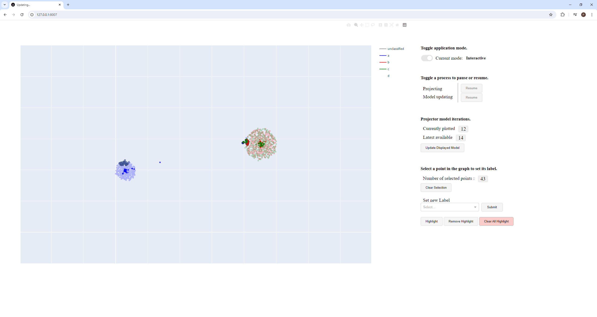
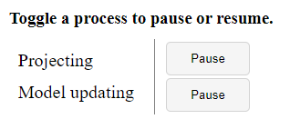

# Online Neurodata and Embedding Projector (ONEP)

The Online Neurodata and Embedding Projector (ONEP) module allows a user to feed a stream of data into a dimensionality reduction model, such as UMAP or CEBRA, in order to create a 2D image. This process will be referred to as projecting. Projecting data from the input stream is executed in real-time, allowing for new data points to be displayed in the 2D projection space whenever new data is published to the stream. Additionally, the data from the input stream is used to train the underlying projection model, allowing for improved projections over time. ONEP includes a simple graphical interface and the possibility to easily implement new or custom projection methods/algorithms.

ONEP is made to function as a module for the [Dareplane](https://github.com/bsdlab/Dareplane) Framework. Familiarity with the Dareplane Control Room module is assumed. The relevant functionality of the Control Room module is limited to registering a module and importing an input stream.

## Termanology

- **Data/input stream:** The stream known to the Dareplane Control Room and passed to the ONEP module. It provides the application with data to project and use in training its projection model.
- **Projecting:** Transforming data from a higher dimensional space to a 2D space.
- **Projection:** The result of projecting data from the input stream to the 2D space.
- **Projected/Projection Point:** The projection of a data point from the input stream specifically referred to in the context of the 2D space to which it is projected.
- **Projection model:** An instance of a projection algorithm such as UMAP or CEBRA. Projection models can be trained with higher dimensional data in order to learn how to project such data to a lower dimensional (2D) space.
- **Projector:** The component of the application that is responsible for training and maintaining a projection model and producing projections using this model. It also reads data from the input stream and triggers the event to plot projected data.
- **Projector processes:** The two main tasks performed by the projector: training new projection models/model iterations and reading, projecting, and plotting data from the data stream. These processes are performed independently, each running on its own dedicated threat. 
- **Projector (model) iteration:** An instance of a trained projection model, managed by the projector. Not every new iteration will automatically be used by the projector. They are referred to as iterations for two reasons. 1) A newly trained projection model is identical to the previous model in terms of settings and hyperparameters. 2) The data used to train previous iterations is a subset of the training data for the new iteration.
- **Updating projector (model):** Setting the projection model iteration used by the projector to the latest iteration that has been trained.
- **Dashboard:** The user interface (UI) of the application as shown in the browser.
- **Plot/figure:** The scatter plot figure onto which the projected points are plotted. This figure is shown on the dashboard. 

## Startup

1. Copy or clone the project code from the GitHub.
2. Install the dependencies from the `requirement.txt` file.
3. Pull git submodules,
    `git submodule update --recursive --remote`
4. If required, implement the desired projection method (see [Implementing a Projection Method](#Implementing-a-Projection-Method)).
5. If required, adjust the configuration file (see [Configuration File](#Configuration-File)).
6. If required, add or adjust the relevant hyperparameter file (see [Configuration File](#Configuration-File)).
7. Run `api/server.py` to launch the ONEP application.
8. Start the Dareplane Control Room and ensure it has access to the stream containing your data.
9. Run the `LAUNCH` command for the ONEP module from the Dareplane Control Room. As an argument, pass the name of your data stream, or ensure the data stream name is set in the configuration (see Configuration File).
10. Once the ONEP UI is available on your browser, run the `START PROJECTING` command from the Control Room to start the projector. Executing this command will allow the projector to begin reading data from the data stream, using it to train the projection model and create projections to display in the 2D figure.

## Notes
- It may occur that takes a long time for a new projection model iteration to be available, particularly for the first iteration. By pauzing the projection process, the model training may proceed a lot faster. It is recommended to do so for the first iteration of the projection model as this appears to take a longer time than expected. The initial model iteration has been observed to take more time to be fitted despite only the minimum number of data points being used for training it.

## User Interface
<picture>
    <source srcset="./assets/dashboard.png"  media="(prefers-color-scheme: dark)">
    
</picture>

### Figure
The majority of the interface contains the plot/figure that displays the projected data points. Data points are regularly projected to this figure as long as the projecting process of the projector is running. 

**Labeling** 
Points are assigned a color matching their label. The color relates to which label is shown in the figure’s legend and can be set in the “plot settings” section of the configuration file (see [Configuration File](#Configuration-File)).

 **Opacity** 
As new projections are plotted, previous data points will be reduced in opacity. Changing of opacity is not done gradually, instead, points are assigned an opacity level based on how recently they were plotted. Upon plotting a new point, the oldest points in an opacity level are moved over to the next level, usually of a lower opacity value, i,e, more translucent. This will continue until a point is assigned a minimum, user-defined, opacity value.

The opacity levels and how many data points are assigned to each level can be set in the configuration file (see [Configuration File](#Configuration-File)). By default, there are five configured opacity levels: 1.0, 0.75, 0.5, and 0.25. Here 0.25 is the minimum opacity value.

 **Selection and Highlighting** 
Using the interface, points may be selected and given a highlight (see Select and Assign Highlight or Label). Selected points will be given a border. The color and width of this border can be set in the configuration settings (see [Configuration File](#Configuration-File)). By default, the color is set to gray. 

Selected points can also be highlighted. Highlights will be retained upon updating the projector model and will always be set to an opacity value of 1, meaning fully opaque. Additionally, highlighted points are increased in size and given a border. The highlight size, border, and border size can each be set in the configuration (see [Configuration File](#Configuration-File)).

 **Updating Projector** 
Whenever a new iteration of the projector model is selected, all projected data points will be recomputed and the figure will be updated with the new projections. This means that all data points are plotted anew, making it seem as if all points are being shifted in the figure.
 
To make it easier for the user to track the shifting of the points, the Plotly backend utilizes a transition animation. Visually, this will appear to the user as if the points are moving around in the 2D space, moving to their new position in a straight line. The duration of this transition animation can be set in the configuration (see [Configuration File](#Configuration-File)). By default, this transition lasts 500 ms.

 **Axis** 
The coordinates in the 2D image of the projected data are in an arbitrary unit and their absolute value is not relevant, only the relative position between the projected points should be considered. For this reason, the axes are automatically rescaled and their values are hidden by default. Axes step values can be shown by changing the configuration option `show-axis` to true (see [Configuration File](#Configuration-File)).

Note, for technical reasons, the plotted data is normalized to a 0-1 range, meaning the coordinates of the data points in the figure should not be seen as informative. The shape and the relative distance of the projected points are maintained while normalizing. 

Additionally, the range of the axis is automatically rescaled on a page refresh (including the initial page load) in order to ensure the figure is visualized as a square space. Meaning that the displayed distance between the steps along each axis is of equal size. This scaling is done based on the size of the monitor. As such, **if the window containing the UI is moved to a monitor of a different size, it is recommended refresh the page**.

###  Projecting and Interactive Mode
<picture>
    <source srcset="./assets/dashboard-application-mode.png"  media="(prefers-color-scheme: dark)">
    
</picture>

The interface allows a user to switch the application between two modes, projection mode and interactive mode. By default, the application will run in projection mode. 

**Projection Mode** 
The application will read data from the input stream, train the projection model, and create projections that are displayed in the figure. When the application is in this mode, available interactions with the figure are limited. For example, zooming in to a specific area or selecting a multitude of points is not possible. It is still possible to select individual points in the figure. 

 **Interactive Mode** 
This mode enables the user to interface with the figure freely. It is recommended to activate this mode whenever intending to highlight data points or change their labels. Upon activating this mode, the projector processes are paused (see [Pausing Projector Processes](#Pausing-Projector-Processes)). When interactive mode is switched off, projector processes are resumed. If a projector functionality was already paused upon activating interactive mode, it will not be unpaused upon toggling off interactive mode. It is not possible to turn on any of these projector processes while interactive mode is active.

###  Pausing Projector Processes
<picture>
    <source srcset="./assets/dashboard-pause-resume-buttons.png"  media="(prefers-color-scheme: dark)">
    
</picture>

In the background, two processes are active that are managed by the projector. 1) projecting and plotting new data points, 2) training a new iteration of the projector. Either of these processes can be paused at any point. 

Note that pausing either of these processes will not halt their current operation. If a data point is being projected, pausing this process will allow the application to finish projecting this point, however, it will not start projecting any new points until it is unpaused. Similarly, when pausing the projection model updating, the application will continue training a model if this process has already started, but will not start a new training session until this process has been unpaused.

If it is desirable to interrupt the current training or projection process, it is recommended to make use of the `Stop Projector` command in the control room (see [Control Room Commands](#Control-Room-Commands)).

Upon switching to interactive mode, both projector processes will be paused. 

###  Activate Latest Model Iteration
<picture>
    <source srcset="./assets/dashboard-model-iteration-update.png"  media="(prefers-color-scheme: dark)">
    
</picture>

As new iterations of the projection model are trained, these iterations will become available. To make it easier to keep track of the projections, the figure is not automatically updated to utilize the latest model iteration. Instead, by clicking the “apply latest iteration” button, the latest model iteration can be applied manually at a time convenient to the user. This may be done in both projection and interaction mode. 

The counter noted “currently used” refers to the iteration of the projector model that is currently being used to project novel data points and display them in the figure. The counter noted “latest available” displays the latest iteration of the projector model that has been trained and may be applied as the active model version.

The “Update Display Model” is disabled by default, becoming interactable the moment there is a newer iteration available compared to the one being used.

###  Select and Assign Highlight or Label
<picture>
    <source srcset="./assets/dashboard-selection-highlighting.png"  media="(prefers-color-scheme: dark)">
    
</picture>

When in interactive mode, the standard Plotly box-select and lasso-select functions can be used to select one or multiple points on the figure. Alternatively, a single point may be selected or deselected by being clicked on. Selected points will by default be given a gray border. This visual effect might differ based on the provided configurations (see [Configuration File](#Configuration-File)). 

> **Note.** The application currently displays some odd behavior when it comes to selecting and deselecting points by clicking on them. When selecting a point by clicking on it, the same point cannot be clicked again immediately in order to deselect it. Instead, click on a different point first, then on the previously selected point or use the “Deselect Points” button.

 **Assigning a label** 
Upon selecting one or multiple points in the figure, it becomes possible to select a label from the dropdown menu. The user may select a desired label and press the “submit” button to apply this label to all of the selected points. 

 **Highlighting** 
By selecting the “highlight” button, the application will highlight all selected points. By default, these points will increase in size, are applied a gray border, and become opaque. They will retain this highlighting until it is removed by the user. Highlights of selected points can be removed by pressing the “Remove Highlight” button. All highlights may be removed by pressing the “Clear All Highlights” button. Note that this will remove highlights of all points, even those that are not selected.

## Control Room Commands
<picture>
    <source srcset="./assets/dareplane-control-room.png"  media="(prefers-color-scheme: dark)">
    
</picture>

In addition to the default `Stop` and `Close` control room commands, ONEP introduces three additional commands: `Launch`, `Start Projector`, and `Stop Projector`.

**Launch** 
Launches the ONEP dashboard and initiates the projector. No training of the projector model is done at this point, nor any reading from the data stream.

 **Start Projector** 
Starts the projector processes to train new iterations of the projector model and to project data points once the first model iteration has been trained.

 **Stop Projector** 
Stops the above-mentioned projector processes. Note, unlike the pause buttons of the dashboard, this command will interrupt the threads of the projector processes, meaning the current iteration being trained and the projection being created will be lost. 

> **Note.** After running the `Stop Projector` command, it is possible to resume the projector processes by running `Start Projector`. The internal state of the application will be retained, meaning the figure and projector model iterations are still available. Do note that the application does not read from the data stream whenever the projector is stopped.

## Configuration File

The configuration file can be found at  `./configs/config.toml`.

It is possible to either change the existing configuration file or add a new one. To set the configuration file used by the application, assign the variable `config_file_name` in main.py with the target configuration file. If the file is placed in a different folder than the default configuration file, also update the config_folder variable to reflect this.

Additionally, there is a folder called `./configs/hyperparameters`. This folder contains the configuration for the hyperparameters used by the projection method. Given that each projection method has varying hyperparameters, there is no template for these files. Hyperparameter config files already exist for all implemented projection methods. The general settings contain a mapping between the projector method and its hyperparameter config file location.

### General Settings
- **host** *[string]*: Host address the server is exposed on.
- **host** *[int]*: Port the server is exposed on.
- **dashboard-host** *[string]*: Host address the dashboard is exposed on.
- **dashboard-port** *[int]*: Port the dashboard is exposed on.
- **data-stream-name** *[string]*: The name of the data/input stream as configured in the Dareplane Control Center. Will be ignored when the data stream name is passed in the `Launch` command.
- **labels** *[list of strings]*: An exhaustive list of labels assigned to the data. If the data contains a label that is not in this list, the application is prone to throw errors or produce undesired behavior.
- **unclassified-label** *[string]*: The label given to any unclassified data points.
- **hyperparameter-config-folder** *[string]*: Path to the folder containing the hyperparameter config files. The path is relative to main.py.
- **hyperparameter-config-files** *[dictionary of string-any]*: Denotes the file name of the hyperparameter config file matchin a specific projection method.

### Projector Settings
- **projection-method** *[string]*: Specifies which projection algorithm to be used by the projector. Will throw an error after running the `Launch` command in the control room when this value refers to an unimplemented projection method.
- **min-training-samples-to-start-projecting** *[int]*: Numbers of data samples that the projector will train on before it begins creating projections. 
- **stream-buffer-size-s** *[float]*: Size of the buffer used when reading from the data stream, given in seconds. Determines the number of data points that may be read from the stream at once. The true buffer size is based on this field and the sampling frequency of the stream. 
- **max-sampling-frequency** *[float]*: The maximum frequency at which data points are projected and plotted. Also determines the frequency at which data is read from the stream (this does not affect the stream buffer size). The true sampling frequency may be lower than the provided value if the application projects and plots data at a slower rate than the provided frequency.
- **max-model-update-frequency** *[float]*: The maximum frequency at which the projector is updated. The true update frequency may be lower than the provided value if the application creates new model iterations at a slower rate than the provided frequency.

### Plot Settings
- **scatter-point-size** *[float]*: Size of the projection points of the figure.
- **point-selection-border-size** *[float]*: Size of the border of a selected point. 
- **point-selection-border-color** *[string]*: Color of the border of a selected point.
- **point-highlight-size** *[float]*: Size of a highlighted point.
- **point-highlight-border-size** *[float]*: Size of the border of a highlighted point.
- **point-highlight-border-color** *[string]*: Color of the border of a highlighted point.
- **unclassified-label-color** *[string]*: Color of the unclassified label.
- **min-opacity** *[float]*: Minimum opacity that can be assigned to a point.
- **show-axis** *[boolean]*: Whether to show the numerical values along the axes.
- **transition-duration** *[float]*: Duration of the transition animation in milliseconds.
- **label-colors** *[dictionary of string-string]*: The colors to be used for the labels of the data. Not all labels need to be assigned a color. Unassigned labels will be given a random color whenever the application is launched.
- **opacity-thresholds** *[dictonary of float-int]*: Each opacity level and the maximum number of points that may belong to that level. The order of the opacity levels used by the application matches the order of the entries of this field.
- **default-x-range** *[float, float]*: The static range of the x-axis of the figure. May be provided a start and end value. This will not change the normalization of the data points, meaning this field primarily sets the empty space surrounding the [0-1] range in which the data points are plotted. Must be empty If automatic scaling of the x-axis is desired (see User [Interface - Figure - Axes](#Axis)).
- **default-y-range**  *[float, float]*: The static range of the y-axis of the figure. May be provided a start and end value. This will not change the normalization of the data points, meaning this field primarily sets the empty space surrounding the [0-1] range in which the data points are plotted. Required If automatic scaling of the x-axis is desired (see User [Interface - Figure - Axes](#Axis)).

### Dashboard Settings
- **graph-refresh-rate-per-ms** *[float]*: Number of times the figure is refreshed on the dashboard. Only when the figure is refreshed, changes, such as new data points, will be displayed in the UI. The refresh rate is only used during projection mode. During interactive mode, the figure is refreshed upon each action taken by the user that leads to a change to the figure.  

## Implementing a Projection Method
ONEP allows users to add additional projection algorithms in a relatively simple manner. The most important part of adding an algorithm is creating a wrapper class that contains a number of function definitions that are called by the Projector class. This can be achieved by ensuring that your wrapper class is compatible with the `i_projector_method.py` interface class, i.e. the wrapper class should implement this interface.

When creating your wrapper class, there are two recommended methods to implement the required functions. Either import the method as a package if this is available or import the Git source code of the method as a submodule. The latter option requires a bit more work. For an example of either option, see `umap_wrapper.py` and `cebra_wrapper.py` in the `./projector/projection_methods` folder. The UMAP wrapper class is implemented using a package reference while the CEBRA wrapper uses a Git submodule.

Below a step-by-step guide is given on how to implement a new projection method.

 **When using a package reference in the wrapper class **
1. Install the package in your environment 
2. (optionally) add the package reference to the `Requirements.txt` file

 **When using a Git submodule in the wrapper class **
1. Import the method source code as a Git submodule. Select the following folder as the submodule location:  
    `./projector/projection_method/submodules/[your method]`
2. Add the path to the new submodule in the reference paths of the `depency_resolver.py`. It should look similar to the CEBRA submodule path which is already added.

 **General steps** 
1. Expand the `projection_methods_enum.py` class with an enum entry for your class.
2. Create a wrapper class in the `./projector/projection_methods` folder.
3. Use the function description as given in the `i_projector_method.py` interface to implement all required functions in your wrapper class and have the 4. wrapper class implement the interface. See the `umap_wrapper.py` and `cebra_wrapper.py` files for references.*
4. In the `embedding_projector.py` class, expand the match statement in the `_resolve_projection_method()` function to include the initiation of your wrapper function.

> **Note.**
You may need or do not need a parameter in one of the function definitions that is or is not provided in the interface. In case you do not need a parameter, simply add it to the function definition and ignore it. In the case you need an additional parameter, you will have to make some changes to embedding_projector.py to accompany this. Do not update this interface function definition, this will break the implementation of other methods.

